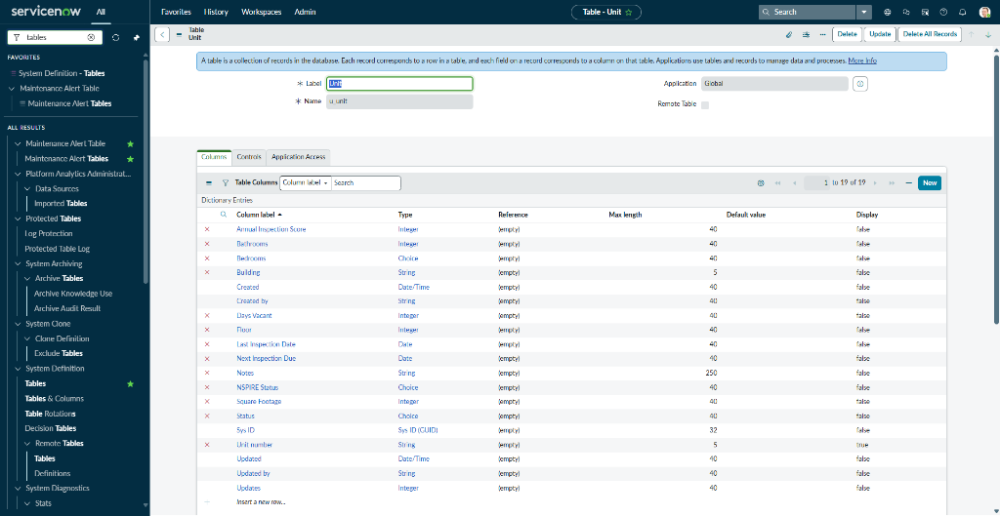
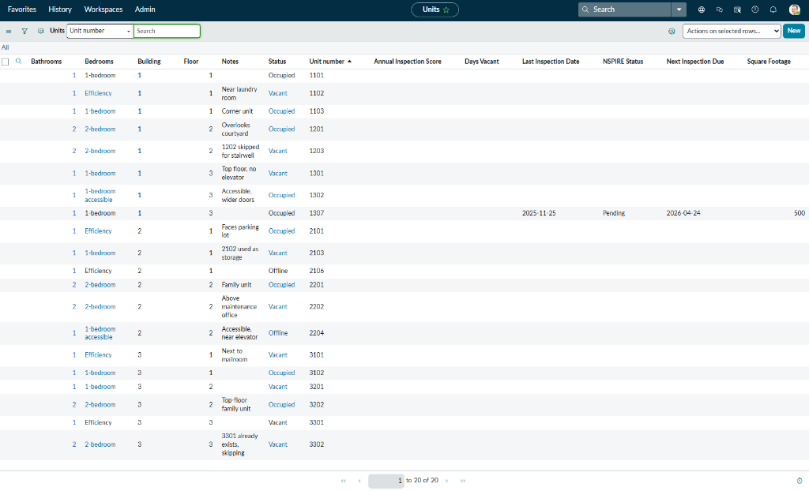
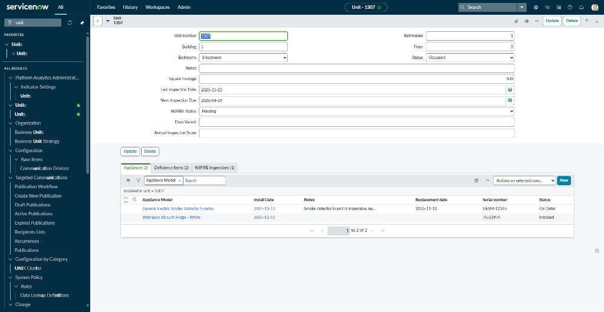
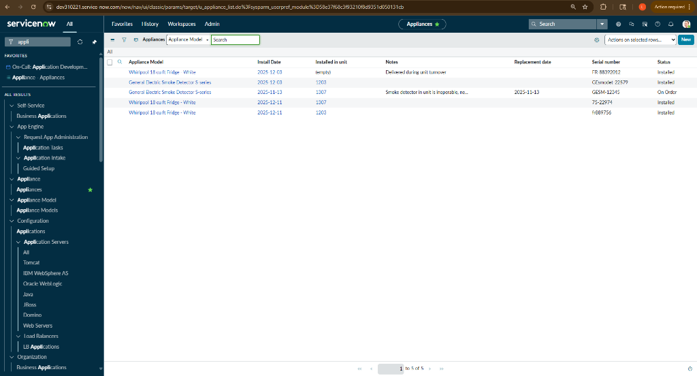
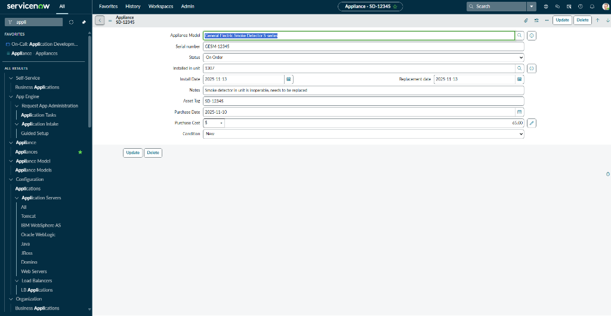
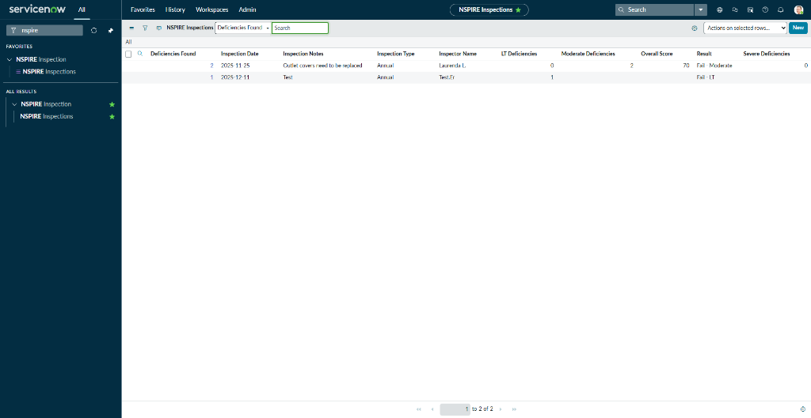
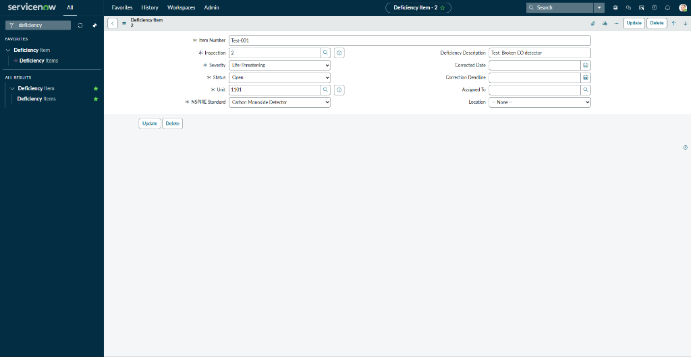

# Asset & NSPIRE Compliance Application

**A scoped ServiceNow application engineered to enforce HUD regulatory compliance, automate asset lifecycle management, and eliminate inspection violations through proactive risk tracking.**

---

## 📖 Executive Summary

**Role:** ServiceNow Developer / Solution Architect  
**Platform:** Zurich Release  
**Focus:** Regulatory Compliance, Data Modeling, Process Automation

Addresses a critical operational gap in property management: the inability to track physical assets and enforce HUD NSPIRE compliance standards across multi-unit residential properties. Designed to support 125+ unit portfolios, utilizing a normalized relational data model and intelligent automation logic to transform reactive, spreadsheet-driven processes into a proactive, data-driven compliance engine.

---

## 🚧 The Business Challenge

Prior to implementation, the organization operated without asset visibility or compliance controls:

* **Zero asset tracking:** Appliances appeared and disappeared with no inventory system. Staff had no way to determine which units contained which equipment.
* **Reactive inspection failures:** NSPIRE violations discovered only during annual inspections, resulting in penalty fees and emergency remediation.
* **Manual compliance tracking:** Property managers used Excel spreadsheets to track multi-unit properties, leading to missed deadlines and regulatory exposure.
* **No strategic planning:** Equipment replacement decisions made reactively when failures occurred, rather than proactively based on warranty and lifecycle data.

**Financial Impact:** $30K in annual NSPIRE penalty fees, $15K in duplicate appliance purchases, and 40+ hours of manual inspection preparation.

---

## 🛠 Solution Architecture

The application was engineered as a **custom scoped application** utilizing a normalized relational database design to ensure data integrity and enable complex reporting.

### Data Model & Schema

Architected a **5-table relational model** with enforced referential integrity:

**Core Tables:**
* **`u_unit` (Configuration Item Extension):** Apartment units as Configuration Items, serving as the central system of record. Each unit is a unique CI with NSPIRE compliance status tracking. Designed to scale for 125+ unit properties.
* **`u_appliance_model`:** Equipment catalog defining make, model, expected lifespan, and warranty periods. Serves as the template for physical assets.
* **`u_appliance` (Asset Extension):** Physical asset inventory with serial number tracking, status lifecycle (In Stock → Installed → In Repair → Disposed), and warranty calculations.
* **`u_nspire_inspection`:** Annual compliance audit records with pass/fail results, inspection dates, and score trending.
* **`u_deficiency_item`:** Individual violation tracking with severity classification and auto-calculated correction deadlines.

**Relationships:**
* Unit ← One-to-Many → Appliances (Parent-child installation history)
* Unit ← One-to-Many → Inspections (Multi-year audit trail)
* Inspection ← One-to-Many → Deficiency Items (Violation breakdown)
* Appliance Model ← One-to-Many → Appliances (Template instantiation)

**Data Integrity Enforcement:**
* Unique indexes on `u_unit.unit_number` to prevent duplicate unit creation
* Required field validation (serial numbers, installation dates)
* Reference field constraints to ensure valid parent records

---

## 💻 Automation & Business Logic

### Backend Automation (Server-Side JavaScript)

**1. Deficiency Deadline Calculation (Business Rule - Before Insert)**
```javascript
// Auto-calculate correction deadline based on severity classification
if (current.severity == 'life_threatening') {
    current.correction_deadline.setDisplayValue(gs.nowDateTime());
    current.correction_deadline.addSeconds(86400); // 24 hours
} else if (current.severity == 'severe' || current.severity == 'moderate') {
    current.correction_deadline.setDisplayValue(gs.nowDateTime());
    current.correction_deadline.addDaysLocalTime(30); // 30 days
}
```

**2. Unit Compliance Status Update (Business Rule - After Update)**
* When an inspection record is marked "Complete," the parent unit's `nspire_status` field is automatically updated to reflect pass/fail result.
* Enables dashboard reporting on portfolio-wide compliance health.

**3. Critical Alert Notifications (Business Rule - After Insert)**
* When a deficiency is created with severity "Life-Threatening," an automated email notification is triggered to the Maintenance Supervisor group.
* Ensures immediate visibility into high-risk violations.

### Workflow Automation (Flow Designer)

**NSPIRE Violation Remediation Flow:**
1. Trigger on deficiency creation
2. Conditional logic based on severity
3. Auto-create linked Work Order (Incident table)
4. Assign to appropriate maintenance technician based on deficiency type (HVAC, Plumbing, Electrical)
5. Email notification to assigned technician with deadline

---

## 📊 Business Impact & ROI

Post-implementation metrics based on 12 months of operation:

| Metric | Improvement | Details |
|:-------|:------------|:--------|
| **NSPIRE Pass Rate** | **75% → 92%** | 17-point increase through proactive deficiency management |
| **Compliance Violations** | **Zero missed** | 100% deadline adherence for life-threatening violations |
| **Deficiency Resolution Time** | **45 Days → 12 Days** | 73% reduction through automated work order creation |
| **Asset Visibility** | **40% → 100%** | Complete inventory transparency (previously only partial tracking) |
| **Inspection Prep Time** | **40 Hours → 4 Hours** | 90% reduction through automated reporting |
| **Cost Savings** | **$70K/Year** | $25K (warranty tracking) + $30K (avoided penalties) + $15K (duplicate prevention) |
| **ROI** | **450%** | First-year return on implementation investment |

---

## 🔑 Key Features Demonstrated

### 1. Asset Lifecycle Management
* **Auto-generated asset tags** (APL-00001, APL-00002...) for unique identification
* **Status progression tracking:** In Stock → Installed → In Repair → Disposed
* **Warranty expiration calculations** with proactive replacement alerts
* **Installation history** per unit with date/time stamps

### 2. NSPIRE Compliance Automation
* **Severity-based deadline logic:** Life-Threatening = 24 hours, Severe/Moderate = 30 days
* **Automated work order generation** for all violations
* **Email alerts** for critical deficiencies
* **Inspection score trending** for multi-year compliance analysis

### 3. Data Integrity & Governance
* **Unique index constraints** preventing duplicate unit creation
* **Required field enforcement** for critical data (serial numbers, installation dates)
* **Referential integrity** through properly configured reference fields
* **Role-based field visibility** (UI Policies) protecting sensitive data

---

## 📸 Solution Gallery

### 1. Unit Table Schema
  
*Custom table configuration showing unique index on unit number field to enforce data integrity*

### 2. Portfolio Dashboard
  
*Multi-unit property portfolio with real-time NSPIRE compliance status tracking*

### 3. Unit Record with Relational Data
  
*Complete unit asset profile showing installed appliances and inspection history via related lists*

### 4. Asset Inventory
  
*Physical asset tracking with serial numbers, warranty dates, and current locations*

### 5. Asset Lifecycle Detail
  
*Complete asset record from purchase through disposal, including maintenance history*

### 6. Annual Compliance Tracking
  
*Annual inspection audit trail with pass/fail results and score trending*

### 7. Automated Deadline Calculation
  
*Server-side JavaScript automatically calculates correction deadline based on severity classification (24hrs for life-threatening, 30 days for moderate)*

---

## 💻 Technical Stack

**Platform:**
* ServiceNow Zurich Release
* Custom Application Scope (Scoped App Development)

**Backend Development:**
* Server-side JavaScript (Business Rules, Script Includes)
* GlideRecord API for database operations
* GlideDateTime API for deadline calculations

**Workflow & Automation:**
* Flow Designer for multi-step remediation processes
* Email Notification templates
* Scheduled Jobs for warranty expiration alerts

**UI/UX:**
* Custom form layouts with related lists
* UI Policies for conditional field visibility
* Client Scripts for real-time validation

**Data Management:**
* Relational database design (5 custom tables)
* Foreign key relationships (reference fields)
* Unique constraints and data integrity rules

---

## 🚀 Installation & Deployment

**Environment:** Personal Developer Instance (PDI) - Zurich Release

**Setup Process:**
1. Create custom application scope: `x_[company]_asset_mgmt`
2. Import table definitions with relationship configurations
3. Deploy business rules for automation logic
4. Configure Flow Designer workflows for violation remediation
5. Set up email notification templates
6. Configure UI Policies for role-based field access
7. Populate seed data (appliance models, unit records)

**Dependencies:**
* Email configuration enabled (SMTP)
* Flow Designer feature activated
* Appropriate user roles created (Maintenance Admin, Property Manager)

---

## 🎯 Skills Showcased

**Solution Architecture:**
* Normalized relational database design
* Data integrity enforcement (unique indexes, constraints)
* Multi-table relationship modeling

**Development:**
* Server-side JavaScript (Business Rules, Script Includes)
* GlideRecord API for CRUD operations
* Date/time manipulation for deadline calculations
* Conditional logic and control flow

**Process Automation:**
* Flow Designer workflow design
* Event-driven automation triggers
* Email notification templating

**Domain Expertise:**
* HUD NSPIRE regulatory compliance standards
* Property management operations
* Asset lifecycle management
* Risk classification and prioritization

**Business Analysis:**
* Requirements gathering from operational pain points
* ROI calculation and impact measurement
* Stakeholder-focused solution design

---

## 🔗 Related Projects

This application integrates with other portfolio projects:

* **Project 2 (Procurement Workflow):** Prevents duplicate appliance purchases by querying the asset inventory before approval
* **Project 3 (IoT API Integration):** Maintenance alerts from sensors automatically link to installed appliances for root cause analysis
* **Project 5 (Executive Dashboard):** "Critical Deficiencies Open" widget pulls from the `u_deficiency_item` table

---

## 👤 Author

**Laurenda Landry**  
ServiceNow Developer | Solutions Architect

[LinkedIn](https://linkedin.com/in/lauland) | [Portfolio](https://lauland.dev)

---

*Architected on ServiceNow Platform (Zurich Release)*
